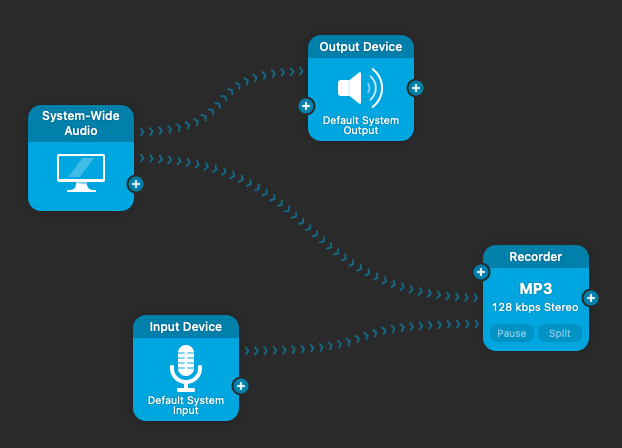

# Recordi

A personal macOS menu-bar recorder. Audio Hijack captures your microphone and computer audio into one recording; whisper.cpp transcribes it locally into a plain text file.

Click **Start Recording**, then **Stop Recording** when finished. Transcription runs in the background, and **Open Latest Transcript** selects the newest `.txt` in Finder. Audio Hijack only needs to run during recording; Recordi leaves it closed until you start another recording.

## Easy setup (Apple Silicon)

1. Download **Recordi-Apple-Silicon.zip** from the [latest release](https://github.com/Ben-Keller/recordi/releases/latest), signed in to the GitHub account with access to this private repository.
2. Extract the whole ZIP and open **Start Here.html**.
3. Install Audio Hijack in Applications, then double-click **Set Up Recordi.command**. A Terminal window displays progress; no commands need to be typed.
4. Choose **Download** for the 1.6 GB model or **Use Existing File** to reuse `ggml-large-v3-turbo.bin` from another Mac. An installed model is reused automatically.
5. Follow the illustrated Audio Hijack instructions and try a short recording.

The download includes the app and a self-contained Whisper engine. **No Git, Homebrew, developer tools, or signing certificate is needed on the new Mac.** Internet is only needed if the model must be downloaded. To copy the existing model, find it under `~/Library/Application Support/Recordi/models/` on the first Mac. You can place it beside the setup file or select it when prompted.

This personal package is signed with the project's local identity, **not notarized by Apple**. If macOS blocks the setup file or app, use **System Settings → Privacy & Security → Open Anyway** after the first opening attempt, as described in [Apple's instructions](https://support.apple.com/en-gb/102445). Keep the setup window open; after approving a blocked item, return to it and press Return to retry the failed step. Setup verifies the generated Audio Hijack scripts before reporting success. Errors and progress are saved to `~/Library/Application Support/Recordi/setup.log`. Do not disable Gatekeeper. Once installed, updates do not build or sign anything on the new Mac; normal macOS privacy permissions still apply.

The package targets Apple Silicon and macOS 13+. It has been tested on this development Mac in an isolated home, without Homebrew in PATH; a clean second-Mac installation remains to be confirmed.

## Install from source (developers / Intel Macs)

You need macOS 13 or later, Apple Command Line Tools with Swift 5.9 or later, Homebrew, and Audio Hijack 4 with external scripting support. This project has been tested on Apple Silicon with macOS 26.4.1, Audio Hijack 4.6.0, and whisper.cpp 1.9.4; other configurations have not been verified.

1. Install [Audio Hijack](https://rogueamoeba.com/audiohijack/) in Applications.
2. Install Apple's developer tools by running the following in Terminal, and wait for the installation to finish:

   ```bash
   xcode-select --install
   ```

3. Install [Homebrew](https://brew.sh/) and follow its instructions to add `brew` to your shell's PATH.
4. Clone this private repository using a GitHub account that has access. With the GitHub CLI installed and authenticated (`brew install gh`, then `gh auth login`):

   ```bash
   mkdir -p ~/Documents
   gh repo clone Ben-Keller/recordi ~/Documents/Recordi
   cd ~/Documents/Recordi
   ./scripts/setup-signing.sh
   ./install.sh
   ```

   If `~/Documents/Recordi` already contains this checkout, use it instead of cloning again. Do not clone over an existing data folder.

The installer builds `~/Applications/Recordi.app`, installs Whisper if needed, downloads and verifies the approximately 1.6 GB model, runs a sample transcription, and launches Recordi. It may install ffmpeg if the available Whisper build cannot read MP3 or FLAC directly. Internet access is needed for setup; recording and transcription run locally afterward.

Approve requested Keychain, Documents, notification, and audio permissions. Enable **Launch at Login** in Recordi's menu if desired. Full Xcode and Accessibility permission are not required.

The signing setup creates a persistent identity in this Mac's login Keychain so updates retain the same app identity. Run it once per Mac. Do not copy another Mac's signing files or recreate the identity for routine updates.

If Audio Hijack is installed elsewhere:

```bash
RECORDI_AUDIO_HIJACK='/path/to/Audio Hijack.app' ./install.sh
```

## Configure Audio Hijack

1. Enable **Settings → Advanced → Allow execution of external scripts**.
2. Create exactly one session named **Meeting Recorder**.
3. Route **System-Wide Audio** through an **Output Device** for listening and into a **Recorder**. Connect your microphone's **Input Device** to that same Recorder. Keep the microphone out of the Output Device path to avoid monitoring/feedback. No separate left/right routing is needed.
4. Set the Recorder to **MP3, 128 kbps stereo**, with automatic date/time filenames, no automatic splitting, and this destination on the new Mac:

   ```text
   ~/Documents/Recordi/recordings/
   ```

You can use the existing working session as a reference, but check the microphone, output device, and destination on each Mac.

The intended routing is shown below. System audio goes separately to the Output Device and Recorder; the microphone goes only to the Recorder. There is no Output Device → Recorder connection.



For immediate transcription after stopping:

1. Open **Window → Script Library** and create a script called **Transcribe Finished Recording**.
2. Paste the contents of the script generated by installation on this Mac:

   ```text
   ~/Library/Application Support/Recordi/commands/Transcribe Finished Recording.js
   ```

3. In **Meeting Recorder → Scripting → New Automation**, choose **Recording Stop** and run that script.

Generated scripts contain this Mac's helper path; do not reuse a script copied from another account. If the callback is missed, Recordi also scans for finished recordings while idle, normally recovering them after about 30 seconds.

## Check the setup

Make a short recording containing both your voice and some computer audio. Stop, wait for transcription, and use **Open Latest Transcript** to find the text. Check that both sources were captured and the original audio remains in `recordings/`.

**Diagnostics** shows dependency/session status, failed jobs, and logs. **Retry Failed Jobs** retries failed transcriptions. Starting a new recording does not wait for an earlier transcription to finish.

## Files and privacy

Everything you work with is under `~/Documents/Recordi`:

| Folder | Contents |
| --- | --- |
| `recordings/` | Original MP3, FLAC or WAV audio, preserved after transcription |
| `transcripts/` | Plain text transcripts only |
| `logs/` | Processing and app logs |

**Open Recordi Folder** opens this folder. The model, queue, completion metadata, generated commands, and local configuration live in `~/Library/Application Support/Recordi/`.

Recordings, transcripts, logs, model files, generated commands, signing material, and build output are excluded from Git. The committed audio fixtures are public JFK samples used only for tests. Recordi does not upload recordings or transcripts and does not configure syncing between Macs. Transcriptions can contain recognition errors.

## Update

For the packaged app, download the new release and run **Set Up Recordi.command** again. Existing audio, text, logs, and the verified model are preserved.

For a source checkout:

```bash
cd ~/Documents/Recordi
git pull --ff-only
./install.sh
```

Installation preserves recordings, transcripts, logs, and the model. Keep the original local signing identity. If you move Audio Hijack, rerun installation with its new path.

## Development and checks

```bash
./scripts/test.sh          # Core behavior and transcription pipeline tests
./scripts/build.sh         # Release app, signed with the local identity
./scripts/test-launch.sh   # Isolated native app/menu smoke test
./scripts/test-install.sh  # Isolated installation and uninstall preservation
```

The installer also runs real MP3 and FLAC transcriptions of the bundled public sample. No test starts a live microphone recording. Test output stays in temporary directories or `.build/`.

## Build a download (maintainers)

With CMake, Apple Command Line Tools, and the existing local signing identity on the build Mac:

```bash
./scripts/package.sh
```

This builds pinned whisper.cpp v1.9.4 from checksum-verified official source, statically links its libraries with embedded Metal shaders, signs the helper and app, and creates `.build/download/Recordi-Apple-Silicon.zip` plus `SHA256SUMS.txt`. The app bundles the upstream license notices. No recordings, transcripts, signing keys, or model are packaged. The archive is a private GitHub release asset, not a Git source file.

Run `scripts/test-package.sh` against the extracted package before publishing. Publishing/notarization and automatic updates are deliberately separate from this simple setup.

## Uninstall

For the packaged app, quit Recordi and move `~/Applications/Recordi.app` to the Trash. Your data and model stay in place. Remove the Recording Stop automation from Audio Hijack.

For a source checkout, quit Recordi, then run:

```bash
./uninstall.sh --dry-run
./uninstall.sh
```

Recordings, transcripts, logs, completion records, the model, and the signing identity are kept. Remove the Recording Stop automation from Audio Hijack manually. Homebrew dependencies are kept.
